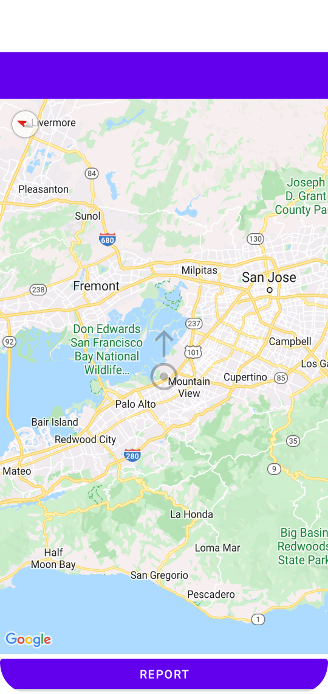

# missile-map
Crowd-sourced cruise missile warning system.

### Goal:
  Provide crowd-sourced **warning system against cruise missile attacks** over populated areas.

### Rationale:
  Cruise missiles are relatively slow moving targets that, never-the-less, pose significant threat.
  Low flying altitudes make detection and tracking of cruise missiles challenging for conventional anti-aircraft defence radars.

### Suggested solution:
* Use crowd-sourcing to track guided missiles
* A person with installed application will be able to report location & direction of observed missle
* Cloud server will process (authenticate, filter and aggregate) the reports and provide live map of known threats

### Implementation:
* REST API server using python FastAPI (https://fastapi.tiangolo.com/).
* MongoDB for backend storage (https://www.mongodb.com/). Using odmantic (https://art049.github.io/odmantic/) to simplify object access.
* Android client-side application with Google Maps integration.

## Setup instructions:

### Requirements:
* Android Studio
* Python (3.x, tested with 3.10)
* MongoDB
* Python package requirements listed in requirements.txt

Development is performed on Linux, but Windows OS should work as well.

### Dev environment setup:
* git clone git@github.com:gshklover/missile-map.git
* For Android application, open missile-map/android in AndroidStudio
* For server application, open missile-map/server in PyCharm

### Running:
* Run mongod on standard port (27017) locally
* Run all tests under server/test directory
